# Chapter 3: Services and Networking - Opening the Doors

Having 3 NGINX pods running is great, but they are completely isolated. Pods are ephemeral: they get destroyed, recreated, and their IP addresses change constantly. We can't rely on connecting directly to a Pod's IP.

To solve this, Kubernetes uses **Services**. A Service acts as a fixed, stable endpoint that forwards traffic to our dynamic Pods.

Let's explore the three main types of Services we tested during the practice.

---

## 1. ClusterIP: The Internal Door

By default, Services are of type `ClusterIP`. This means the service is **only reachable from inside the cluster**. It is perfect for microservices communicating with each other (e.g., a Backend talking to a Database).

Let's expose our `webapp` deployment internally:

```bash
@Dearxia1 ➜ /workspaces/kubepractice (main) $ kubectl expose deployment webapp --name=webapp-clusterip --port=80 --target-port=80 --type=ClusterIP
service/webapp-clusterip exposed

@Dearxia1 ➜ /workspaces/kubepractice (main) $ kubectl get service webapp-clusterip
NAME               TYPE        CLUSTER-IP     EXTERNAL-IP   PORT(S)   AGE
webapp-clusterip   ClusterIP   10.98.159.20   <none>        80/TCP    74s
```

> **Testing it:**
> Since it's internal, I can't reach `10.98.159.20` from my browser or from my Codespace terminal! I have to create an ephemeral "student" pod inside the cluster just to test it:
> 
> ```bash
> @Dearxia1 ➜ /workspaces/kubepractice (main) $ kubectl run test-client --image=busybox --rm -it -- sh
> / # wget -O- webapp-clusterip
> ...
> <h1>Welcome to nginx!</h1>
> ```
> It works! The internal DNS resolved `webapp-clusterip` to the Service's IP and forwarded my request to one of the NGINX pods.

### Architectural View: ClusterIP

```mermaid
flowchart TD
    ClientPod["Internal Client Pod (e.g., busybox)"]
    Service["ClusterIP Service\n(Stable IP)"]
    
    subgraph "webapp Deployment"
        Pod1["Pod 1 (NGINX)"]
        Pod2["Pod 2 (NGINX)"]
        Pod3["Pod 3 (NGINX)"]
    end

    ClientPod -- "wget webapp-clusterip" --> Service
    Service -. "Load balances" .-> Pod1
    Service -. "Load balances" .-> Pod2
    Service -. "Load balances" .-> Pod3

    style ClientPod fill:#2d3436,stroke:#74b9ff,stroke-width:2px
    style Service fill:#0984e3,stroke:#74b9ff,color:#fff,stroke-width:2px
```


---

## 2. NodePort: The External Door (For Development)

If we want to access our application from outside the cluster, we can use a `NodePort`. This opens a specific port (between 30000-32767) on the **Node's IP address**.

```bash
@Dearxia1 ➜ /workspaces/kubepractice (main) $ kubectl expose deployment webapp --name=webapp-nodeport --port=80 --target-port=80 --type=NodePort
service/webapp-nodeport exposed

@Dearxia1 ➜ /workspaces/kubepractice (main) $ kubectl get service webapp-nodeport
NAME              TYPE       CLUSTER-IP       EXTERNAL-IP   PORT(S)        AGE
webapp-nodeport   NodePort   10.110.181.181   <none>        80:30513/TCP   11s
```

> **Testing it:**
> Notice the `PORT(S)` column: `80:30513/TCP`. It mapped port 80 of the pods to port `30513` on the Minikube node itself.
> I can get the node's IP using `minikube ip` (`192.168.49.2`) and hit it directly from my Codespace terminal!
> ```bash
> @Dearxia1 ➜ /workspaces/kubepractice (main) $ curl http://192.168.49.2:30513
> ...
> <h1>Welcome to nginx!</h1>
> ```

### Sneaking Inside: How does NodePort actually work?

Curious about how the Node magic actually happens, I ssh'ed directly into the Minikube virtual machine to check its firewall routing rules (`iptables`):

```bash
@Dearxia1 ➜ /workspaces/kubepractice (main) $ minikube ssh
docker@minikube:~$ sudo iptables -t nat -L KUBE-NODEPORTS -n
Chain KUBE-NODEPORTS (1 references)
target     prot opt source               destination         
KUBE-EXT-...  6    --  0.0.0.0/0            0.0.0.0/0          /* default/webapp-nodeport */ tcp dpt:30513
```
Kubernetes literally modifies the host network rules to redirect anything hitting port `30513` straight into our Service!

### Architectural View: NodePort

```mermaid
flowchart TD
    ExternalClient["External Browser / Terminal"]
    Node["Minikube Node (192.168.49.2)\nPort: 30513"]
    Service["NodePort Service"]
    
    subgraph "webapp Deployment"
        Pod1["Pod 1"]
        Pod2["Pod 2"]
    end

    ExternalClient -- "http://192.168.49.2:30513" --> Node
    Node -- "iptables NAT rule" --> Service
    Service -. "Forwards" .-> Pod1
    Service -. "Forwards" .-> Pod2

    style ExternalClient fill:#2d3436,stroke:#fdcb6e,stroke-width:2px
    style Node fill:#d63031,stroke:#fab1a0,color:#fff,stroke-width:2px
    style Service fill:#0984e3,stroke:#74b9ff,color:#fff,stroke-width:2px
```


---

## 3. LoadBalancer: The Cloud-Ready Door

While NodePort works, it's clunky. In production, we don't want to tell users to visit `IP:30513`. We want a clean entry point. The `LoadBalancer` service type talks directly to cloud providers (like AWS or Azure) to provision a real, external Load Balancer.

In Minikube, it simulates this behavior.

```bash
@Dearxia1 ➜ /workspaces/kubepractice (main) $ kubectl expose deployment webapp --name=webapp-lb --port=80 --target-port=80 --type=LoadBalancer
service/webapp-lb exposed

@Dearxia1 ➜ /workspaces/kubepractice (main) $ kubectl get service webapp-lb
NAME        TYPE           CLUSTER-IP      EXTERNAL-IP     PORT(S)        AGE
webapp-lb   LoadBalancer   10.102.28.180   10.102.28.180   80:32684/TCP   2m17s
```

> **Testing it:**
> Notice that `EXTERNAL-IP` now has an actual value (`10.102.28.180`). We don't need ports anymore!
> ```bash
> @Dearxia1 ➜ /workspaces/kubepractice (main) $ curl 10.102.28.180
> ...
> <h1>Welcome to nginx!</h1>
> ```

### Architectural View: LoadBalancer

```mermaid
flowchart TD
    Internet["Internet User"]
    CloudLB["Cloud Provider Load Balancer\n(External IP: 10.102.28.180)"]
    Service["LoadBalancer Service"]
    
    subgraph "Kubernetes Node"
        subgraph "webapp Deployment"
            Pod1["Pod 1"]
            Pod2["Pod 2"]
        end
    end

    Internet -- "http://10.102.28.180" --> CloudLB
    CloudLB --> Service
    Service -. "Forwards" .-> Pod1
    Service -. "Forwards" .-> Pod2

    style Internet fill:#2d3436,stroke:#00b894,stroke-width:2px
    style CloudLB fill:#00b894,stroke:#55efc4,color:#fff,stroke-width:2px
    style Service fill:#0984e3,stroke:#74b9ff,color:#fff,stroke-width:2px
```



So, what if we have multiple microservices (a frontend and a backend) and want to route traffic to them based on the URL path (`/frontend` or `/backend`) instead of creating a huge bill paying for 50 different Cloud LoadBalancers? That's where **Ingress** comes play. 

[⬅️ Go to previous chapter: Deployments and Pods](./02-deployments-and-pods.md) | [➡️ Go to next chapter: Ingress Routing](./04-ingress-routing.md)
