# Chapter 4: Ingress Routing - The Smart Traffic Cop

Instead of exposing every single microservice as a separate LoadBalancer (which would cost a lot of money in the real cloud), we can use an **Ingress**. 

Think of Ingress as a smart traffic cop. It sits behind a single external IP address and routes traffic to different internal Services based on the rules we define (like the URL path).

### 1. Setting up the Target Architecture

To test this, we need more than one application. Let's create a `backend` and a `frontend`:

```bash
@Dearxia1 ➜ /workspaces/kubepractice (main) $ kubectl create deployment backend --image=nginx:alpine --replicas=2
deployment.apps/backend created

@Dearxia1 ➜ /workspaces/kubepractice (main) $ kubectl expose deployment backend --name=backend-service --port=80 --type=ClusterIP
service/backend-service exposed

@Dearxia1 ➜ /workspaces/kubepractice (main) $ kubectl create deployment frontend --image=nginx:alpine --replicas=2
deployment.apps/frontend created

@Dearxia1 ➜ /workspaces/kubepractice (main) $ kubectl expose deployment frontend --name=frontend-service --port=80 --type=LoadBalancer
service/frontend-service exposed
```

> **Wait, why is backend a ClusterIP?**
> Good practice! The frontend is meant to be accessible to users (which is why we temporarily gave it a LoadBalancer), but the backend should only be reachable internally.

### 2. Enabling the Ingress Controller

By default, an Ingress object is just a piece of paper with rules. To make it work, we need a program that reads those rules and acts upon them. That program is called an **Ingress Controller** (usually backed by NGINX or HAProxy).

In Minikube, we simply enable it as an addon:

```bash
@Dearxia1 ➜ /workspaces/kubepractice (main) $ minikube addons enable ingress

🔎  Verifying ingress addon...
🌟  The 'ingress' addon is enabled

@Dearxia1 ➜ /workspaces/kubepractice (main) $ kubectl get pods -n ingress-nginx
NAME                                        READY   STATUS      RESTARTS   AGE
ingress-nginx-controller-596f8778bc-x7l4r   1/1     Running     0          6m39s
```

### 3. Creating the Routing Rules

Now we write the rules. We want the Ingress to catch traffic going to `/frontend` and send it to our frontend service.

```bash
@Dearxia1 ➜ /workspaces/kubepractice (main) $ cat <<EOF | kubectl apply -f -
apiVersion: networking.k8s.io/v1
kind: Ingress
metadata:
  name: example-ingress
  annotations:
    nginx.ingress.kubernetes.io/rewrite-target: /
spec:
  rules:
  - http:
      paths:
      - path: /frontend
        pathType: Prefix
        backend:
          service:
            name: frontend-service
            port:
              number: 80
      - path: /backend
        pathType: Prefix
        backend:
          service:
            name: backend-service
            port:
              number: 80
EOF

ingress.networking.k8s.io/example-ingress created
```

### 4. Testing the Magic

Let's get the IP address of our new single "front door" (the Ingress):

```bash
@Dearxia1 ➜ /workspaces/kubepractice (main) $ INGRESS_IP=$(kubectl get ingress example-ingress -o jsonpath='{.status.loadBalancer.ingress[0].ip}')
@Dearxia1 ➜ /workspaces/kubepractice (main) $ echo $INGRESS_IP
192.168.49.2
```

Now, using that single IP, we can reach different applications!

```bash
@Dearxia1 ➜ /workspaces/kubepractice (main) $ curl $INGRESS_IP/frontend
<h1>Welcome to nginx!</h1>  <!-- Returned by the frontend pods -->

@Dearxia1 ➜ /workspaces/kubepractice (main) $ curl $INGRESS_IP/backend
<h1>Welcome to nginx!</h1>  <!-- Returned by the backend pods -->
```

### Architectural View: Ingress Routing

```mermaid
flowchart TD
    Client["Client Request"]
    IngressController["Ingress Controller\n(Single IP: 192.168.49.2)"]
    
    FrontService["frontend-service\n(LoadBalancer)"]
    BackService["backend-service\n(ClusterIP)"]
    
    subgraph "Frontend Deployment"
        FrontPod1["Frontend Pod 1"]
        FrontPod2["Frontend Pod 2"]
    end
    
    subgraph "Backend Deployment"
        BackPod1["Backend Pod 1"]
        BackPod2["Backend Pod 2"]
    end

    Client -- "URL: /frontend" --> IngressController
    Client -- "URL: /backend" --> IngressController

    IngressController -- "If /frontend\nRule Match" --> FrontService
    IngressController -- "If /backend\nRule Match" --> BackService

    FrontService -.-> FrontPod1
    FrontService -.-> FrontPod2

    BackService -.-> BackPod1
    BackService -.-> BackPod2

    style Client fill:#2d3436,stroke:#a29bfe,stroke-width:2px
    style IngressController fill:#6c5ce7,stroke:#a29bfe,color:#fff,stroke-width:2px
```



### Cleaning Up

To finish our practice, it's always good practice to delete the test deployments so they aren't eating up RAM in the background.

```bash
@Dearxia1 ➜ /workspaces/kubepractice (main) $ kubectl delete deployment webapp frontend backend
```

[⬅️ Go to previous chapter: Services and Networking](./03-kubernetes-services.md) | [➡️ Go to next chapter: Conceptual Questions answered](./05-conceptual-questions.md)
